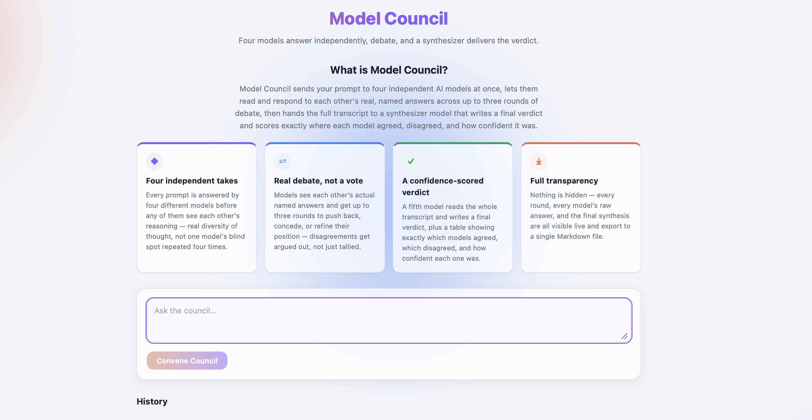

# Model Council

Send one prompt to four different LLMs, let them read and argue with each other's named answers across up to three rounds, then have a fifth model write the final verdict.



---

## Features

- **Four models answer independently** in parallel, before any of them sees another's reasoning.
- **Up to three debate rounds** where each model is shown the other models' real, attributed answers and can concede, push back, or hold its position.
- **A convergence gate** — a judge call after round 2 decides whether round 3 is needed at all, so easy prompts don't pay for a third round.
- **A synthesized verdict** from a fifth model, plus an agree / disagree / partial table with each model's self-reported confidence.
- **Live streaming** of every model's tokens to the browser over Server-Sent Events.
- **Session persistence** in SQLite, with a history list to reopen any past run.
- **Markdown export** of a whole session — prompt, every round, every answer, verdict, table.
- **Graceful degradation** — a model that errors or times out is marked `no_response` for that round and never blocks the other three.
- **87 tests, zero real API calls.** The OpenRouter client sits behind an interface with a scriptable fake, so the suite never spends money.

## Tech stack

| Layer | What |
|---|---|
| Language | TypeScript (strict), ESM |
| Frontend | React 18, Vite 5, hand-written CSS (no UI framework) |
| Backend | Express 4, `tsx` for dev execution |
| Streaming | Server-Sent Events (backend → browser), OpenRouter's streaming chat API (backend → models) |
| Storage | SQLite via `better-sqlite3` |
| Tests | Vitest + Testing Library + supertest (18 files, 87 tests) |
| LLM access | OpenRouter (single API, five models) |

Five runtime dependencies total: `express`, `react`, `react-dom`, `better-sqlite3`, `dotenv`.

## How it works

**Where the API calls happen.** All five models are reached through one place: `RealOpenRouterClient` in `server/openrouter/client.ts`, which POSTs to `https://openrouter.ai/api/v1/chat/completions` with `stream: true` and parses the SSE byte stream into tokens. The browser never talks to OpenRouter and never sees the API key — it only opens an `EventSource` against this app's own `/api/sessions/:id/stream`.

**How the four models are chosen.** They aren't chosen at runtime — the roster is a hardcoded constant, `COUNCIL_MODELS` in `shared/types.ts`:

| Role | Model | OpenRouter ID |
|---|---|---|
| Council | Claude Sonnet 5 | `anthropic/claude-sonnet-5` |
| Council | GPT-5.6 Luna | `openai/gpt-5.6-luna` |
| Council | Grok latest | `~x-ai/grok-latest` (the leading `~` is required) |
| Council | Gemini 3.5 Flash Lite | `google/gemini-3.5-flash-lite` |
| Synthesizer | Claude Opus 5 | `anthropic/claude-opus-5` |

**The flow** (`CouncilOrchestrator.run`, `server/council/orchestrator.ts`):

1. **Round 1 — independent answers.** All four models are called in parallel with the same system prompt: answer with your own independent reasoning, and end with a line `Confidence: N%`. Each model sees only the user's prompt.
2. **Round 2 — debate (always runs).** Each model is sent the prompt again, plus the *other three* models' round-1 answers, labelled with their real names ("Claude Sonnet 5 said: …"). Models are never anonymized to each other. Answers that failed in the prior round are left out. The instruction: say whether you agree, disagree, or partially agree, and why — you may revise or hold your position.
3. **Convergence check.** The synthesizer gets the full transcript and must reply `CONVERGED` or `NOT_CONVERGED` plus one sentence. Round 3 runs **only** if the reply does not start with `CONVERGED`.
4. **Round 3 — optional, final.** Identical to round 2, but fed round 2's answers. Three rounds is a hard cap.
5. **Synthesis.** The synthesizer reads every successful answer from every round and writes the verdict, ending with a `VERDICT_TABLE:` block of `<Model Name> | agree|disagree|partial` lines. The parser (`parseVerdictTable`) reads that block, tolerating real-world Markdown drift — pipe tables, separator rows, bold emphasis — and joins each row to that model's last-round answer and parsed confidence.

Both synthesizer calls (the convergence check and the final synthesis) get **three attempts with linear backoff**, because the run has no result without them. Council models get no retry — they just drop out of that round.

Per run that means **10 OpenRouter calls** if the council converges after round 2 (4 + 4 + 1 judge + 1 synthesis), or **14** if round 3 fires.

## Run locally

A local-only app — there is no deployment, no hosted demo, and no production server. You run it on your own machine against your own OpenRouter key.

Requires **Node 18, or Node 20 and above** (the strictest constraint among the installed dependencies, from Vite and Vitest; developed and verified on Node 22). The backend also relies on global `fetch`.

```bash
git clone https://github.com/krishnaagrawal17/Model_council.git
cd Model_council
npm install

cp .env.example .env     # then paste your OpenRouter key into .env
npm run dev
```

**One terminal, not two.** `npm run dev` uses `concurrently` to start the Express backend (port 3001) and the Vite dev server together. Vite proxies `/api` to the backend, so you only open the Vite URL — `http://localhost:5173` by default.

If `OPENROUTER_API_KEY` isn't set, the server prompts for it on stdin at startup and writes it to `.env` itself. That works, but it's easier to fill in `.env` first, since the prompt competes with Vite's output under `concurrently`.

Other scripts, all from the repo root:

```bash
npm test         # vitest run — 87 tests, no network, no cost
npm run typecheck # tsc --noEmit
npm run build     # vite build (frontend bundle only)
```

## Environment variables

| Name | Purpose | Where to get it |
|---|---|---|
| `OPENROUTER_API_KEY` | **Required.** Authenticates every model call. | [openrouter.ai/keys](https://openrouter.ai/keys) — needs a funded account. |
| `PORT` | Optional. Express backend port. Defaults to `3001`. | Your choice — but the Vite proxy in `vite.config.ts` is hardcoded to `localhost:3001`, so change both. |
| `DB_PATH` | Optional. SQLite file for sessions. Defaults to `model-council.sqlite`. | Your choice. |

> **This app costs real money to run.** An OpenRouter key is mandatory and every submitted prompt makes 10–14 billed calls across five models, including two passes of a frontier model over the whole transcript. The project's own notes estimate roughly **$0.08–$0.13 per prompt**, though that figure was recorded by hand, not measured in code. The test suite never calls the real API.

## Changing which models are used

Edit `shared/types.ts` — it's the single source of truth:

- `COUNCIL_MODELS` — the four debaters. Order and count are load-bearing: `CouncilModelId` is a union of these literals, and `parseVerdictTable` warns when the synthesizer returns a different number of rows.
- `SYNTHESIZER_MODEL_ID` — the judge/synthesizer.
- `MODEL_LABELS` — the display names, which are also the names models see each other by in debate and the keys the verdict-table parser matches on.

Then update `MODEL_THEME` in `src/modelTheme.ts` (per-model accent colour and avatar initial) and the matching CSS custom properties in `src/index.css`.

**Verify any new ID against OpenRouter's live `/api/v1/models` list before wiring it in.** Grok's entry here is `~x-ai/grok-latest`; the bare `x-ai/grok-latest` is rejected outright with `400: not a valid model ID`. That cost a debugging session.

## Status

Honest state of the project, confirmed against the code.

**Works**
- The whole debate pipeline: four parallel answers → debate round → convergence gate → optional round 3 → synthesized verdict and agreement table.
- Live token streaming of all council rounds into per-model cards.
- SQLite persistence; history list; reopening a past session renders it fully.
- Markdown export of a complete session.
- A failing council model degrades to `no_response` without stalling the round; synthesizer calls retry with backoff.
- Interactive first-run API key setup.
- `npm test` → 18 files, 87/87 passing. `npm run typecheck` → clean. Both verified on the current commit.

**Partial**
- **The verdict doesn't stream.** The backend emits synthesis tokens (`phase: 'synthesis'`), but the frontend reducer buckets them where nothing renders them, so the verdict appears all at once when the run completes.
- **Per-model retry is backend-only.** The route, orchestrator method, client function and tests all exist and work; no UI component calls them.
- **Final positions are captured but never shown.** `VerdictRow.finalPosition` is parsed and persisted, but neither the on-screen table nor the Markdown export includes that column.
- **Session-level errors are silent.** A run whose synthesizer exhausts all retries is stored as `status: 'error'`, but the UI renders no message — the form just re-enables. Per-model `model_error` events are collected into state and likewise never displayed (the failed card does read "No response").

**Not built**
- **No `max_tokens` cap on model calls.** `client.ts` sends no token limit, so OpenRouter reserves each
  model's full 65K-token ceiling against your credit before the call runs. Per-call cost is therefore
  unbounded, and on a low balance the most expensive models (Opus 5, Sonnet 5) are rejected with
  `402 Payment Required` while the cheaper three still answer — producing a run that looks like a model
  refusal but is purely a billing reservation.
- No error handling on any frontend fetch — `createSession`, `fetchSession` and `fetchHistory` all throw into nothing.
- No model picker in the UI; the roster is a code constant.
- No production serve path. `npm run build` bundles the frontend, but Express never serves it — dev mode is the only way to run the app.
- No auth, no multi-user support, no session deletion, no token/cost accounting, and no CI.

---

Built with AI assistance (Claude Code) using a spec-first workflow: a written design spec and a 17-task TDD implementation plan (both in `docs/superpowers/`) came before any code, and each task was implemented test-first and reviewed before the next one started.
